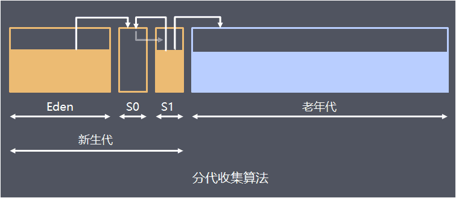
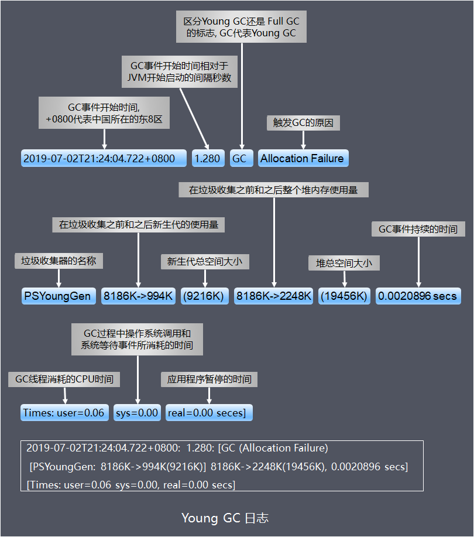
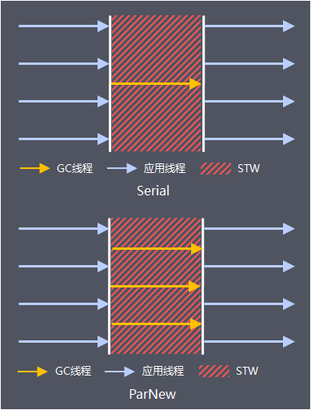
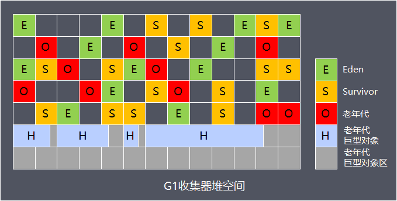
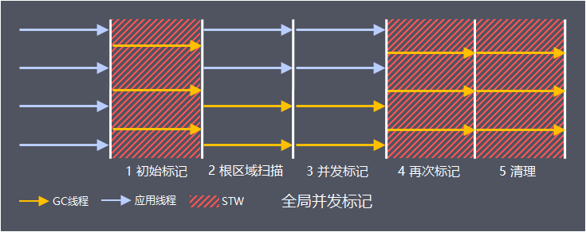

本文介绍 GC 基础原理和理论，GC 调优方法思路和方法，基于 Hotspot jdk1.8，学习之后你将了解如何对生产系统出现的 GC 问题进行排查解决。

 

内容主要如下：

- GC 基础原理，涉及调优目标，GC 事件分类、JVM 内存分配策略、GC 日志分析等。 
- CMS 原理及调优。 
- G1 原理及调优。 
- GC 问题排查和解决思路。

## GC 基础原理

**GC 调优目标**

大多数情况下对 Java 程序进行 GC 调优，主要关注两个目标：

- 响应速度(Responsiveness)：响应速度指程序或系统对一个请求的响应有多迅速。

比如，用户订单查询响应时间，对响应速度要求很高的系统，较大的停顿时间是不可接受的。调优的重点是在短的时间内快速响应。

- 吞吐量(Throughput)：吞吐量关注在一个特定时间段内应用系统的最大工作量。

例如每小时批处理系统能完成的任务数量，在吞吐量方面优化的系统，较长的 GC 停顿时间也是可以接受的，因为高吞吐量应用更关心的是如何尽可能快地完成整个任务，不考虑快速响应用户请求。

GC 调优中，GC 导致的应用暂停时间影响系统响应速度，GC 处理线程的 CPU 使用率影响系统吞吐量。

**GC 分代收集算法**

现代的垃圾收集器基本都是采用分代收集算法，其主要思想： 将 Java 的堆内存逻辑上分成两块：新生代、老年代，针对不同存活周期、不同大小的对象采取不同的垃圾回收策略。


 
 

**新生代(Young Generation)**

新生代又叫年轻代，大多数对象在新生代中被创建，很多对象的生命周期很短。

每次新生代的垃圾回收(又称 Young GC、Minor GC、YGC)后只有少量对象存活，所以使用复制算法，只需少量的复制操作成本就可以完成回收。

新生代内又分三个区：一个 Eden 区，两个 Survivor 区(S0、S1，又称From Survivor、To Survivor)，大部分对象在 Eden 区中生成。

当 Eden 区满时，还存活的对象将被复制到两个 Survivor 区(中的一个);当这个 Survivor 区满时，此区的存活且不满足晋升到老年代条件的对象将被复制到另外一个 Survivor 区。

对象每经历一次复制，年龄加 1，达到晋升年龄阈值后，转移到老年代。

**老年代(Old Generation)**

在新生代中经历了 N 次垃圾回收后仍然存活的对象，就会被放到老年代，该区域中对象存活率高。老年代的垃圾回收通常使用“标记-整理”算法。

**GC 事件分类**

根据垃圾收集回收的区域不同，垃圾收集主要分为：

- Young GC 
- Old GC 
- Full GC 
- Mixed GC

**①Young GC**

新生代内存的垃圾收集事件称为 Young GC(又称 Minor GC)，当 JVM 无法为新对象分配在新生代内存空间时总会触发 Young GC。

比如 Eden 区占满时，新对象分配频率越高，Young GC 的频率就越高。

Young GC 每次都会引起全线停顿(Stop-The-World)，暂停所有的应用线程，停顿时间相对老年代 GC 造成的停顿，几乎可以忽略不计。

**②Old GC 、Full GC、Mixed GC**

Old GC：只清理老年代空间的 GC 事件，只有 CMS 的并发收集是这个模式。

Full GC：清理整个堆的 GC 事件，包括新生代、老年代、元空间等 。

Mixed GC：清理整个新生代以及部分老年代的 GC，只有 G1 有这个模式。

**GC 日志分析**

GC 日志是一个很重要的工具，它准确记录了每一次的 GC 的执行时间和执行结果，通过分析 GC 日志可以调优堆设置和 GC 设置，或者改进应用程序的对象分配模式。

开启的 JVM 启动参数如下：

```
-verbose:gc -XX:+PrintGCDetails -XX:+PrintGCDateStamps -XX:+PrintGCTimeStamps
```
常见的 Young GC、Full GC 日志含义如下：


 
 

 
 

免费的 GC 日志图形分析工具推荐下面 2 个：

- GCViewer，下载 jar 包直接运行 。 
- gceasy，Web 工具，上传 GC 日志在线使用。

**内存分配策略**

Java 提供的自动内存管理，可以归结为解决了对象的内存分配和回收的问题。

前面已经介绍了内存回收，下面介绍几条最普遍的内存分配策略：

**①对象优先在 Eden 区分配**：大多数情况下，对象在先新生代 Eden 区中分配。当 Eden 区没有足够空间进行分配时，虚拟机将发起一次 Young GC。

**②大对象之间进入老年代**：JVM 提供了一个对象大小阈值参数(-XX:PretenureSizeThreshold，默认值为 0，代表不管多大都是先在 Eden 中分配内存)。

大于参数设置的阈值值的对象直接在老年代分配，这样可以避免对象在 Eden 及两个 Survivor 直接发生大内存复制。

**③长期存活的对象将进入老年代**：对象每经历一次垃圾回收，且没被回收掉，它的年龄就增加 1，大于年龄阈值参数(-XX:MaxTenuringThreshold，默认 15)的对象，将晋升到老年代中。

**④空间分配担保**：当进行 Young GC 之前，JVM 需要预估：老年代是否能够容纳 Young GC 后新生代晋升到老年代的存活对象，以确定是否需要提前触发 GC 回收老年代空间，基于空间分配担保策略来计算。

continueSize，老年代最大可用连续空间：


 
 

Young GC 之后如果成功(Young GC 后晋升对象能放入老年代)，则代表担保成功，不用再进行 Full GC，提高性能。

如果失败，则会出现“promotion failed”错误，代表担保失败，需要进行 Full GC。

**⑤动态年龄判定**：新生代对象的年龄可能没达到阈值(MaxTenuringThreshold 参数指定)就晋升老年代。

如果 Young GC 之后，新生代存活对象达到相同年龄所有对象大小的总和大于任意 Survivor 空间(S0+S1空间)的一半，此时 S0 或者 S1 区即将容纳不了存活的新生代对象。

年龄大于或等于该年龄的对象就可以直接进入老年代，无须等到 MaxTenuringThreshold 中要求的年龄。

另外，如果 Young GC 后 S0 或 S1 区不足以容纳：未达到晋升老年代条件的新生代存活对象，会导致这些存活对象直接进入老年代，需要尽量避免。

## CMS 原理及调优

**名词解释**

可达性分析算法：用于判断对象是否存活，基本思想是通过一系列称为“GC Root”的对象作为起点(常见的 GC Root 有系统类加载器、栈中的对象、处于激活状态的线程等)，基于对象引用关系，从 GC Roots 开始向下搜索，所走过的路径称为引用链，当一个对象到 GC Root 没有任何引用链相连，证明对象不再存活。

**Stop The World**：GC 过程中分析对象引用关系，为了保证分析结果的准确性，需要通过停顿所有 Java 执行线程，保证引用关系不再动态变化，该停顿事件称为 Stop The World(STW)。

**Safepoint**：代码执行过程中的一些特殊位置，当线程执行到这些位置的时候，说明虚拟机当前的状态是安全的，如果有需要 GC，线程可以在这个位置暂停。

HotSpot 采用主动中断的方式，让执行线程在运行期轮询是否需要暂停的标志，若需要则中断挂起。

**CMS 简介**

CMS(Concurrent Mark and Sweep 并发-标记-清除)，是一款基于并发、使用标记清除算法的垃圾回收算法，只针对老年代进行垃圾回收。

CMS 收集器工作时，尽可能让 GC 线程和用户线程并发执行，以达到降低 STW 时间的目的。

通过以下命令行参数，启用 CMS 垃圾收集器：

```
-XX:+UseConcMarkSweepGC
```
值得补充的是，下面介绍到的 CMS GC 是指老年代的 GC，而 Full GC 指的是整个堆的 GC 事件，包括新生代、老年代、元空间等，两者有所区分。

**新生代垃圾回收**

能与 CMS 搭配使用的新生代垃圾收集器有 Serial 收集器和 ParNew 收集器。

这 2 个收集器都采用标记复制算法，都会触发 STW 事件，停止所有的应用线程。不同之处在于，Serial 是单线程执行，ParNew 是多线程执行。


 
 

**老年代垃圾回收**


 
 

CMS GC 以获取最小停顿时间为目的，尽可能减少 STW 时间，可以分为 7 个阶段：

**阶段 1：初始标记(Initial Mark)**


 
 

此阶段的目标是标记老年代中所有存活的对象, 包括 GC Root 的直接引用, 以及由新生代中存活对象所引用的对象，触发第一次 STW 事件。

这个过程是支持多线程的(JDK7 之前单线程，JDK8 之后并行，可通过参数 CMSParallelInitialMarkEnabled 调整)。

**阶段 2：并发标记(Concurrent Mark)**


 
 

此阶段 GC 线程和应用线程并发执行，遍历阶段 1 初始标记出来的存活对象，然后继续递归标记这些对象可达的对象。

**阶段 3：并发预清理(Concurrent Preclean)**


 
 

此阶段 GC 线程和应用线程也是并发执行，因为阶段 2 是与应用线程并发执行，可能有些引用关系已经发生改变。

通过卡片标记(Card Marking)，提前把老年代空间逻辑划分为相等大小的区域(Card)。

如果引用关系发生改变，JVM 会将发生改变的区域标记为“脏区”(Dirty Card)，然后在本阶段，这些脏区会被找出来，刷新引用关系，清除“脏区”标记。

**阶段 4：并发可取消的预清理(Concurrent Abortable Preclean)**

此阶段也不停止应用线程。本阶段尝试在 STW 的最终标记阶段(Final Remark)之前尽可能地多做一些工作，以减少应用暂停时间。

在该阶段不断循环处理：标记老年代的可达对象、扫描处理 Dirty Card 区域中的对象，循环的终止条件有：

- 达到循环次数 
- 达到循环执行时间阈值 
- 新生代内存使用率达到阈值

**阶段 5：最终标记(Final Remark)**

这是 GC 事件中第二次(也是最后一次)STW 阶段，目标是完成老年代中所有存活对象的标记。

在此阶段执行：

- 遍历新生代对象，重新标记 
- 根据 GC Roots，重新标记 
- 遍历老年代的 Dirty Card，重新标记

**阶段 6：并发清除(Concurrent Sweep)**


 
 

此阶段与应用程序并发执行，不需要 STW 停顿，根据标记结果清除垃圾对象。

**阶段 7：并发重置(Concurrent Reset)**

此阶段与应用程序并发执行，重置 CMS 算法相关的内部数据, 为下一次 GC 循环做准备。

**CMS 常见问题**

**①最终标记阶段停顿时间过长问题**

CMS 的 GC 停顿时间约 80% 都在最终标记阶段(Final Remark)，若该阶段停顿时间过长，常见原因是新生代对老年代的无效引用，在上一阶段的并发可取消预清理阶段中，执行阈值时间内未完成循环，来不及触发 Young GC，清理这些无效引用。

通过添加参数：-XX:+CMSScavengeBeforeRemark。

在执行最终操作之前先触发 Young GC，从而减少新生代对老年代的无效引用，降低最终标记阶段的停顿。

但如果在上个阶段(并发可取消的预清理)已触发 Young GC，也会重复触发 Young GC。

**②并发模式失败(concurrent mode failure)&晋升失败(promotion failed)问题。**


 
 

并发模式失败：当 CMS 在执行回收时，新生代发生垃圾回收，同时老年代又没有足够的空间容纳晋升的对象时，CMS 垃圾回收就会退化成单线程的 Full GC。所有的应用线程都会被暂停，老年代中所有的无效对象都被回收。


 
 

晋升失败：当新生代发生垃圾回收，老年代有足够的空间可以容纳晋升的对象，但是由于空闲空间的碎片化，导致晋升失败，此时会触发单线程且带压缩动作的 Full GC。

并发模式失败和晋升失败都会导致长时间的停顿，常见解决思路如下：

- 降低触发 CMS GC 的阈值。 
- 即参数 -XX:CMSInitiatingOccupancyFraction 的值，让 CMS GC 尽早执行，以保证有足够的空间。 
- 增加 CMS 线程数，即参数 -XX:ConcGCThreads。 
- 增大老年代空间。 
- 让对象尽量在新生代回收，避免进入老年代。

**③内存碎片问题**

通常 CMS 的 GC 过程基于标记清除算法，不带压缩动作，导致越来越多的内存碎片需要压缩。

常见以下场景会触发内存碎片压缩：

- 新生代 Young GC 出现新生代晋升担保失败(promotion failed)) 
- 程序主动执行System.gc()

可通过参数 CMSFullGCsBeforeCompaction 的值，设置多少次 Full GC 触发一次压缩。

默认值为 0，代表每次进入 Full GC 都会触发压缩，带压缩动作的算法为上面提到的单线程 Serial Old 算法，暂停时间(STW)时间非常长，需要尽可能减少压缩时间。

## G1 原理及调优

**G1 简介**

G1(Garbage-First)是一款面向服务器的垃圾收集器，支持新生代和老年代空间的垃圾收集，主要针对配备多核处理器及大容量内存的机器。

G1 最主要的设计目标是：实现可预期及可配置的 STW 停顿时间。

**G1 堆空间划分**


 
 

**①Region**

为实现大内存空间的低停顿时间的回收，将划分为多个大小相等的 Region。每个小堆区都可能是 Eden 区，Survivor 区或者 Old 区，但是在同一时刻只能属于某个代。

在逻辑上, 所有的 Eden 区和 Survivor 区合起来就是新生代，所有的 Old 区合起来就是老年代，且新生代和老年代各自的内存 Region 区域由 G1 自动控制，不断变动。

**②巨型对象**

当对象大小超过 Region 的一半，则认为是巨型对象(Humongous Object)，直接被分配到老年代的巨型对象区(Humongous Regions)。

这些巨型区域是一个连续的区域集，每一个 Region 中最多有一个巨型对象，巨型对象可以占多个 Region。

G1 把堆内存划分成一个个 Region 的意义在于：

- 每次 GC 不必都去处理整个堆空间，而是每次只处理一部分 Region，实现大容量内存的 GC。 
- 通过计算每个 Region 的回收价值，包括回收所需时间、可回收空间，在有限时间内尽可能回收更多的垃圾对象，把垃圾回收造成的停顿时间控制在预期配置的时间范围内，这也是 G1 名称的由来：Garbage-First。

**G1工作模式**

针对新生代和老年代，G1 提供 2 种 GC 模式，Young GC 和 Mixed GC，两种会导致 Stop The World。

Young GC：当新生代的空间不足时，G1 触发 Young GC 回收新生代空间。

Young GC 主要是对 Eden 区进行 GC，它在 Eden 空间耗尽时触发，基于分代回收思想和复制算法，每次 Young GC 都会选定所有新生代的 Region。

同时计算下次 Young GC 所需的 Eden 区和 Survivor 区的空间，动态调整新生代所占 Region 个数来控制 Young GC 开销。

Mixed GC：当老年代空间达到阈值会触发 Mixed GC，选定所有新生代里的 Region，根据全局并发标记阶段(下面介绍到)统计得出收集收益高的若干老年代 Region。

在用户指定的开销目标范围内，尽可能选择收益高的老年代 Region 进行 GC，通过选择哪些老年代 Region 和选择多少 Region 来控制 Mixed GC 开销。

**全局并发标记**


 
 

全局并发标记主要是为 Mixed GC 计算找出回收收益较高的 Region 区域，具体分为 5 个阶段：

**阶段 1：初始标记(Initial Mark)**

暂停所有应用线程(STW)，并发地进行标记从 GC Root 开始直接可达的对象(原生栈对象、全局对象、JNI 对象)。

当达到触发条件时，G1 并不会立即发起并发标记周期，而是等待下一次新生代收集，利用新生代收集的 STW 时间段，完成初始标记，这种方式称为借道(Piggybacking)。

**阶段 2：根区域扫描(Root Region Scan)**

在初始标记暂停结束后，新生代收集也完成的对象复制到 Survivor 的工作，应用线程开始活跃起来。

此时为了保证标记算法的正确性，所有新复制到 Survivor 分区的对象，需要找出哪些对象存在对老年代对象的引用，把这些对象标记成根(Root)。

这个过程称为根分区扫描(Root Region Scanning)，同时扫描的 Suvivor 分区也被称为根分区(Root Region)。

根分区扫描必须在下一次新生代垃圾收集启动前完成(接下来并发标记的过程中，可能会被若干次新生代垃圾收集打断)，因为每次 GC 会产生新的存活对象集合。

**阶段 3：并发标记(Concurrent Marking)**

标记线程与应用程序线程并行执行，标记各个堆中 Region 的存活对象信息，这个步骤可能被新的 Young GC 打断。

所有的标记任务必须在堆满前就完成扫描，如果并发标记耗时很长，那么有可能在并发标记过程中，又经历了几次新生代收集。

**阶段 4：再次标记(Remark)**

和 CMS 类似暂停所有应用线程(STW)，以完成标记过程短暂地停止应用线程, 标记在并发标记阶段发生变化的对象，和所有未被标记的存活对象，同时完成存活数据计算。

**阶段 5：清理(Cleanup)**

为即将到来的转移阶段做准备, 此阶段也为下一次标记执行所有必需的整理计算工作：

- 整理更新每个 Region 各自的 RSet(Remember Set，HashMap 结构，记录有哪些老年代对象指向本 Region，key 为指向本 Region 的对象的引用，value 为指向本 Region 的具体 Card 区域，通过 RSet 可以确定 Region 中对象存活信息，避免全堆扫描)。 
- 回收不包含存活对象的 Region。 
- 统计计算回收收益高(基于释放空间和暂停目标)的老年代分区集合。

**G1调优注意点**

**①Full GC 问题**

G1 的正常处理流程中没有 Full GC，只有在垃圾回收处理不过来(或者主动触发)时才会出现，G1 的 Full GC 就是单线程执行的 Serial old gc，会导致非常长的 STW，是调优的重点，需要尽量避免 Full GC。

常见原因如下：

- 程序主动执行 System.gc() 
- 全局并发标记期间老年代空间被填满(并发模式失败) 
- Mixed GC 期间老年代空间被填满(晋升失败) 
- Young GC 时 Survivor 空间和老年代没有足够空间容纳存活对象

类似 CMS，常见的解决是：

- 增大 -XX:ConcGCThreads=n 选项增加并发标记线程的数量，或者 STW 期间并行线程的数量：-XX:ParallelGCThreads=n。 
- 减小 -XX:InitiatingHeapOccupancyPercent 提前启动标记周期。 
- 增大预留内存 -XX:G1ReservePercent=n，默认值是 10，代表使用 10% 的堆内存为预留内存，当 Survivor 区域没有足够空间容纳新晋升对象时会尝试使用预留内存。

**②巨型对象分配**

巨型对象区中的每个 Region 中包含一个巨型对象，剩余空间不再利用，导致空间碎片化，当 G1 没有合适空间分配巨型对象时，G1 会启动串行 Full GC 来释放空间。

可以通过增加 -XX:G1HeapRegionSize 来增大 Region 大小，这样一来，相当一部分的巨型对象就不再是巨型对象了，而是采用普通的分配方式。

**③不要设置 Young 区的大小**

原因是为了尽量满足目标停顿时间，逻辑上的 Young 区会进行动态调整。如果设置了大小，则会覆盖掉并且会禁用掉对停顿时间的控制。

**④平均响应时间设置**

使用应用的平均响应时间作为参考来设置 MaxGCPauseMillis，JVM 会尽量去满足该条件，可能是 90% 的请求或者更多的响应时间在这之内， 但是并不代表是所有的请求都能满足，平均响应时间设置过小会导致频繁 GC。

**调优方法与思路**

如何分析系统 JVM GC 运行状况及合理优化?

GC 优化的核心思路在于：尽可能让对象在新生代中分配和回收，尽量避免过多对象进入老年代，导致对老年代频繁进行垃圾回收，同时给系统足够的内存减少新生代垃圾回收次数，进行系统分析和优化也是围绕着这个思路展开。

**分析系统的运行状况**

分析系统的运行状况：

- 系统每秒请求数、每个请求创建多少对象，占用多少内存。 
- Young GC 触发频率、对象进入老年代的速率。 
- 老年代占用内存、Full GC 触发频率、Full GC 触发的原因、长时间 Full GC 的原因。

常用工具如下：

jstat：JVM 自带命令行工具，可用于统计内存分配速率、GC 次数，GC 耗时。

常用命令格式：

```
jstat -gc <pid> <统计间隔时间> <统计次数>
```
输出返回值代表含义如下：


 
 

例如：jstat -gc 32683 1000 10，统计 pid=32683 的进程，每秒统计 1 次，统计 10 次。

jmap：JVM 自带命令行工具，可用于了解系统运行时的对象分布。

常用命令格式如下：

```
// 命令行输出类名、类数量数量，类占用内存大小， 
// 按照类占用内存大小降序排列 
jmap -histo <pid> 
 
// 生成堆内存转储快照，在当前目录下导出dump.hrpof的二进制文件， 
// 可以用eclipse的MAT图形化工具分析 
jmap -dump:live,format=b,file=dump.hprof <pid>
```
jinfo，命令格式：

```
jinfo <pid>
```
用来查看正在运行的 Java 应用程序的扩展参数，包括 Java System 属性和 JVM 命令行参数。

其他 GC 工具：

- 监控告警系统：Zabbix、Prometheus、Open-Falcon 
- jdk 自动实时内存监控工具：VisualVM 
- 堆外内存监控：Java VisualVM 安装 Buffer Pools 插件、google perf工具、Java NMT(Native Memory Tracking)工具 
- GC 日志分析：GCViewer、gceasy 
- GC 参数检查和优化：http://xxfox.perfma.com/

**GC 优化案例**

**①数据分析平台系统频繁 Full GC**

平台主要对用户在 App 中行为进行定时分析统计，并支持报表导出，使用 CMS GC 算法。

数据分析师在使用中发现系统页面打开经常卡顿，通过 jstat 命令发现系统每次 Young GC 后大约有 10% 的存活对象进入老年代。

原来是因为 Survivor 区空间设置过小，每次 Young GC 后存活对象在 Survivor 区域放不下，提前进入老年代。

通过调大 Survivor 区，使得 Survivor 区可以容纳 Young GC 后存活对象，对象在 Survivor 区经历多次 Young GC 达到年龄阈值才进入老年代。

调整之后每次 Young GC 后进入老年代的存活对象稳定运行时仅几百 Kb，Full GC 频率大大降低。

**②业务对接网关 OOM**

网关主要消费 Kafka 数据，进行数据处理计算然后转发到另外的 Kafka 队列，系统运行几个小时候出现 OOM，重启系统几个小时之后又 OOM。

通过 jmap 导出堆内存，在 eclipse MAT 工具分析才找出原因：代码中将某个业务 Kafka 的 topic 数据进行日志异步打印，该业务数据量较大，大量对象堆积在内存中等待被打印，导致 OOM。

**③账号权限管理系统频繁长时间 Full GC**

系统对外提供各种账号鉴权服务，使用时发现系统经常服务不可用，通过 Zabbix 的监控平台监控发现系统频繁发生长时间 Full GC，且触发时老年代的堆内存通常并没有占满，发现原来是业务代码中调用了 System.gc()。

**总结**

GC 问题可以说没有捷径，排查线上的性能问题本身就并不简单，除了将本文介绍到的原理和工具融会贯通，还需要我们不断去积累经验，真正做到性能最优。

篇幅所限，不再展开介绍常见 GC 参数的使用，我发布在 GitHub：

```
https://github.com/caison/caison-blog-demo
```
参考：

- 《Java Performance: The Definitive Guide》 Scott Oaks 
- 《深入理解 Java 虚拟机：JVM 高级特性与最佳实践(第二版》 周志华 
- Java 性能调优实战 
- Getting Started with the G1 Garbage Collector 
- GC 参考手册-Java 版 
- 请教 G1 算法的原理——RednaxelaFX 的回答 
- Java Hotspot G1 GC 的一些关键技术——美团技术团队

** 来源地址 **

[老大难的GC原理及调优，这全说清楚了](https://www.toutiao.com/a6740803737603801604/?tt_from=weixin&utm_campaign=client_share&wxshare_count=1&timestamp=1573131368&app=news_article&utm_source=weixin&utm_medium=toutiao_android&req_id=201911072056080100140481391D1C3E51&group_id=6740803737603801604)
