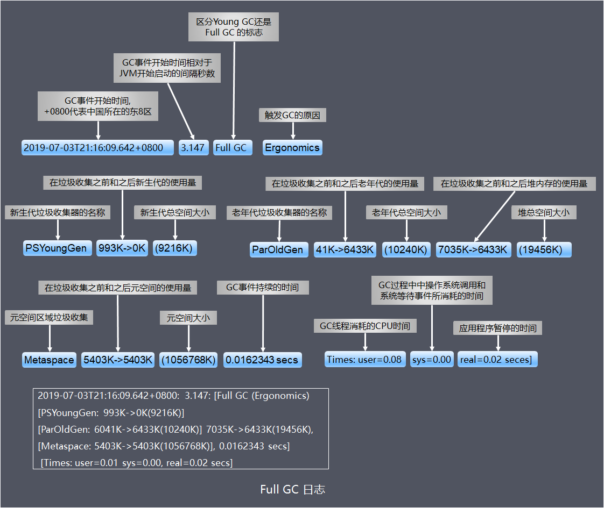
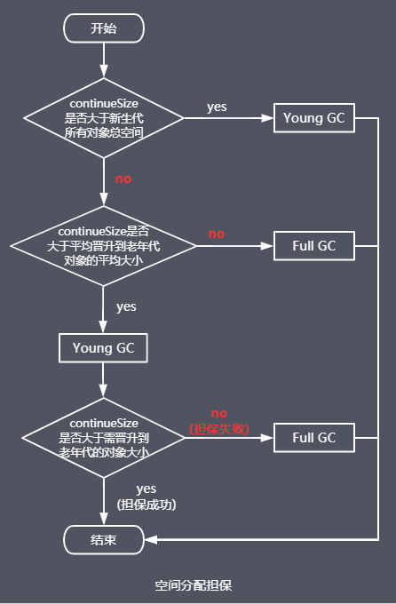
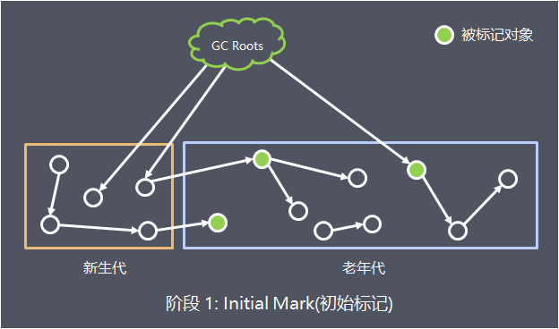
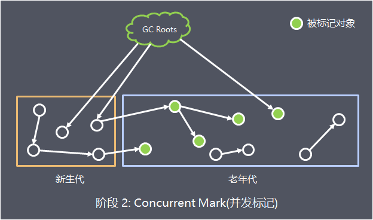
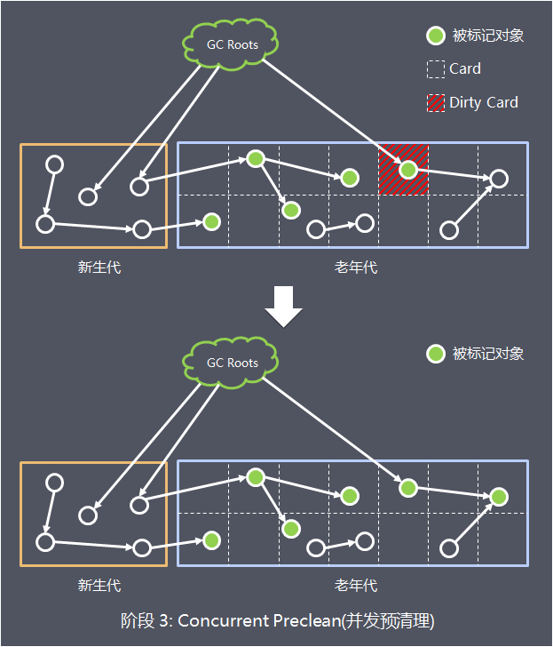
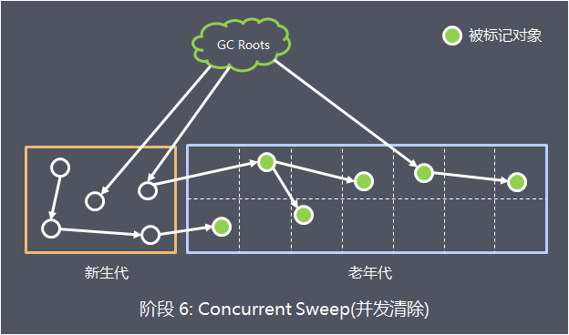

# GC原理及调优
## 概述

本文介绍GC基础原理和理论，GC调优方法思路和方法，基于Hotspot jdk1.8，学习之后将了解如何对生产系统出现的GC问题进行排查解决

阅读时长约30分钟，内容主要如下：

* GC基础原理，涉及调优目标，GC事件分类、JVM内存分配策略、GC日志分析等
* CMS原理及调优
* G1原理及调优
* GC问题排查和解决思路

## GC基础原理

### 1 GC调优目标

大多数情况下对 Java 程序进行GC调优, 主要关注两个目标：响应速度、吞吐量

* **响应速度(Responsiveness)** 响应速度指程序或系统对一个请求的响应有多迅速。比如，用户订单查询响应时间，对响应速度要求很高的系统，较大的停顿时间是不可接受的。调优的重点是在短的时间内快速响应

* **吞吐量(Throughput)** 吞吐量关注在一个特定时间段内应用系统的最大工作量，例如每小时批处理系统能完成的任务数量，在吞吐量方面优化的系统，较长的GC停顿时间也是可以接受的，因为高吞吐量应用更关心的是如何尽可能快地完成整个任务，不考虑快速响应用户请求

GC调优中，GC导致的应用暂停时间影响系统响应速度，GC处理线程的CPU使用率影响系统吞吐量

### 2 GC分代收集算法

现代的垃圾收集器基本都是采用分代收集算法，其主要思想： 将Java的堆内存逻辑上分成两块：新生代、老年代，针对不同存活周期、不同大小的对象采取不同的垃圾回收策略


* 新生代（Young Generation）

新生代又叫年轻代，大多数对象在新生代中被创建，很多对象的生命周期很短。每次新生代的垃圾回收（又称Young GC、Minor GC、YGC）后只有少量对象存活，所以使用复制算法，只需少量的复制操作成本就可以完成回收

新生代内又分三个区：一个Eden区，两个Survivor区(S0、S1，又称From Survivor、To Survivor)，大部分对象在Eden区中生成。当Eden区满时，还存活的对象将被复制到两个Survivor区（中的一个）。当这个Survivor区满时，此区的存活且不满足晋升到老年代条件的对象将被复制到另外一个Survivor区。对象每经历一次复制，年龄加1，达到晋升年龄阈值后，转移到老年代

* 老年代（Old Generation）

在新生代中经历了N次垃圾回收后仍然存活的对象，就会被放到老年代，该区域中对象存活率高。老年代的垃圾回收通常使用"标记-整理"算法

### 3 GC事件分类

根据垃圾收集回收的区域不同，垃圾收集主要通常分为Young GC、Old GC、Full GC、Mixed GC

#### (1) Young GC

新生代内存的垃圾收集事件称为Young GC(又称Minor GC)，当JVM无法为新对象分配在新生代内存空间时总会触发 Young GC，比如 Eden 区占满时。新对象分配频率越高, Young GC 的频率就越高

Young GC 每次都会引起全线停顿(Stop-The-World)，暂停所有的应用线程，停顿时间相对老年代GC的造成的停顿，几乎可以忽略不计

#### (2) Old GC 、Full GC、Mixed GC

**Old GC** ，只清理老年代空间的GC事件，只有CMS的并发收集是这个模式 **Full GC**，清理整个堆的GC事件，包括新生代、老年代、元空间等

* **Mixed GC**，清理整个新生代以及部分老年代的GC，只有G1有这个模式

### 4 GC日志分析

GC日志是一个很重要的工具，它准确记录了每一次的GC的执行时间和执行结果，通过分析GC日志可以调优堆设置和GC设置，或者改进应用程序的对象分配模式，开启的JVM启动参数如下：

``` bash
-verbose:gc -XX:+PrintGCDetails -XX:+PrintGCDateStamps  -XX:+PrintGCTimeStamps
```

常见的Young GC、Full GC日志含义如下：




免费的GC日志图形分析工具推荐下面2个：

* [GCViewer](%5Bhttps://github.com/chewiebug/GCViewer%5D(https://github.com/chewiebug/GCViewer))，下载jar包直接运行
* [gceasy](https://gceasy.io/)，web工具，上传GC日志在线使用

### 5 内存分配策略

Java提供的自动内存管理，可以归结为解决了对象的内存分配和回收的问题，前面已经介绍了内存回收，下面介绍几条最普遍的内存分配策略

* **对象优先在Eden区分配** 大多数情况下，对象在先新生代Eden区中分配。当Eden区没有足够空间进行分配时，虚拟机将发起一次Young GC

* **大对象直接进入老年代** JVM提供了一个对象大小阈值参数(-XX:PretenureSizeThreshold，默认值为0，代表不管多大都是先在Eden中分配内存)，大于参数设置的阈值值的对象直接在老年代分配，这样可以避免对象在Eden及两个Survivor直接发生大内存复制

* **长期存活的对象将进入老年代** 对象每经历一次垃圾回收，且没被回收掉，它的年龄就增加1，大于年龄阈值参数(-XX:MaxTenuringThreshold，默认15)的对象，将晋升到老年代中

* **空间分配担保** 当进行Young GC之前，JVM需要预估：老年代是否能够容纳Young GC后新生代晋升到老年代的存活对象，以确定是否需要提前触发GC回收老年代空间，基于空间分配担保策略来计算：

**continueSize：老年代最大可用连续空间**



Young GC之后如果成功(Young GC后晋升对象能放入老年代)，则代表担保成功，不用再进行Full GC，提高性能；如果失败，则会出现"promotion failed"错误，代表担保失败，需要进行Full GC

* **动态年龄判定** 新生代对象的年龄可能没达到阈值(MaxTenuringThreshold参数指定)就晋升老年代，如果Young GC之后，新生代存活对象**达到相同年龄所有对象大小**的总和大于任一Survivor空间(S0 或 S1总空间)的一半，此时S0或者S1区即将容纳不了存活的新生代对象，年龄大于或等于该年龄的对象就可以直接进入老年代，无须等到MaxTenuringThreshold中要求的年龄

另外，如果Young GC后S0或S1区不足以容纳：未达到晋升老年代条件的新生代存活对象，会导致这些存活对象直接进入老年代，需要尽量避免

## CMS原理及调优

### 1 名词解释

**可达性分析算法**：用于判断对象是否存活，基本思想是通过一系列称为"GC Root"的对象作为起点（常见的GC Root有系统类加载器、栈中的对象、处于激活状态的线程等），基于对象引用关系，从GC Roots开始向下搜索，所走过的路径称为引用链，当一个对象到GC Root没有任何引用链相连，证明对象不再存活

**Stop The World**：GC过程中分析对象引用关系，为了保证分析结果的准确性，需要通过停顿所有Java执行线程，保证引用关系不再动态变化，该停顿事件称为Stop The World(STW)

**Safepoint**：代码执行过程中的一些特殊位置，当线程执行到这些位置的时候，说明虚拟机当前的状态是安全的，如果有需要GC，线程可以在这个位置暂停。HotSpot采用主动中断的方式，让执行线程在运行期轮询是否需要暂停的标志，若需要则中断挂起

### 2 CMS简介

CMS(Concurrent Mark and Sweep 并发-标记-清除)，是一款基于并发、使用标记清除算法的垃圾回收算法，只针对老年代进行垃圾回收。CMS收集器工作时，尽可能让GC线程和用户线程并发执行，以达到降低STW时间的目的

通过以下命令行参数，启用CMS垃圾收集器:

``` bash
-XX:+UseConcMarkSweepGC
```

值得补充的是，下面介绍到的CMS GC是指老年代的GC，而Full GC指的是整个堆的GC事件，包括新生代、老年代、元空间等，两者有所区分

### 3 新生代垃圾回收

能与CMS搭配使用的新生代垃圾收集器有Serial收集器和ParNew收集器。这2个收集器都采用标记复制算法，都会触发STW事件，停止所有的应用线程。不同之处在于，Serial是单线程执行，ParNew是多线程执行


### 4 老年代垃圾回收

CMS GC以获取最小停顿时间为目的，尽可能减少STW时间，可以分为7个阶段


* **阶段 1: 初始标记(Initial Mark)**

此阶段的目标是标记老年代中所有存活的对象, 包括 GC Root 的直接引用, 以及由新生代中存活对象所引用的对象，触发第一次STW事件

这个过程是支持多线程的（JDK7之前单线程，JDK8之后并行，可通过参数CMSParallelInitialMarkEnabled调整）



* **阶段 2: 并发标记(Concurrent Mark)**

此阶段GC线程和应用线程并发执行，遍历阶段1初始标记出来的存活对象，然后继续递归标记这些对象可达的对象



* **阶段 3: 并发预清理(Concurrent Preclean)**

此阶段GC线程和应用线程也是并发执行，因为阶段2是与应用线程并发执行，可能有些引用关系已经发生改变。 通过卡片标记(Card Marking)，提前把老年代空间逻辑划分为相等大小的区域(Card)，如果引用关系发生改变，JVM会将发生改变的区域标记位"脏区"(Dirty Card)，然后在本阶段，这些脏区会被找出来，刷新引用关系，清除"脏区"标记



* **阶段 4: 并发可取消的预清理(Concurrent Abortable Preclean)**

此阶段也不停止应用线程. 本阶段尝试在 STW 的 最终标记阶段(Final Remark)之前尽可能地多做一些工作，以减少应用暂停时间 在该阶段不断循环处理：标记老年代的可达对象、扫描处理Dirty Card区域中的对象，循环的终止条件有： 1 达到循环次数 2 达到循环执行时间阈值 3 新生代内存使用率达到阈值

* **阶段 5: 最终标记(Final Remark)**

这是GC事件中第二次(也是最后一次)STW阶段，目标是完成老年代中所有存活对象的标记。在此阶段执行： 1 遍历新生代对象，重新标记 2 根据GC Roots，重新标记 3 遍历老年代的Dirty Card，重新标记

* **阶段 6: 并发清除(Concurrent Sweep)**

此阶段与应用程序并发执行，不需要STW停顿，根据标记结果清除垃圾对象



* **阶段 7: 并发重置(Concurrent Reset)**

此阶段与应用程序并发执行，重置CMS算法相关的内部数据, 为下一次GC循环做准备

### 5 CMS常见问题

#### 最终标记阶段停顿时间过长问题

CMS的GC停顿时间约80%都在最终标记阶段(Final Remark)，若该阶段停顿时间过长，常见原因是新生代对老年代的无效引用，在上一阶段的并发可取消预清理阶段中，执行阈值时间内未完成循环，来不及触发Young GC，清理这些无效引用

通过添加参数：-XX:+CMSScavengeBeforeRemark。在执行最终操作之前先触发Young GC，从而减少新生代对老年代的无效引用，降低最终标记阶段的停顿，但如果在上个阶段(并发可取消的预清理)已触发Young GC，也会重复触发Young GC

#### 并发模式失败(concurrent mode failure) & 晋升失败(promotion failed)问题


**并发模式失败**：当CMS在执行回收时，新生代发生垃圾回收，同时老年代又没有足够的空间容纳晋升的对象时，CMS 垃圾回收就会退化成单线程的Full GC。所有的应用线程都会被暂停，老年代中所有的无效对象都被回收


**晋升失败**：当新生代发生垃圾回收，老年代有足够的空间可以容纳晋升的对象，但是由于空闲空间的碎片化，导致晋升失败，此时会触发单线程且带压缩动作的Full GC

并发模式失败和晋升失败都会导致长时间的停顿，常见解决思路如下：

* 降低触发CMS GC的阈值，即参数-XX:CMSInitiatingOccupancyFraction的值，让CMS GC尽早执行，以保证有足够的空间
* 增加CMS线程数，即参数-XX:ConcGCThreads，
* 增大老年代空间
* 让对象尽量在新生代回收，避免进入老年代

#### 内存碎片问题

通常CMS的GC过程基于标记清除算法，不带压缩动作，导致越来越多的内存碎片需要压缩，常见以下场景会触发内存碎片压缩：

* 新生代Young GC出现新生代晋升担保失败(promotion failed)
* 程序主动执行System.gc()

可通过参数CMSFullGCsBeforeCompaction的值，设置多少次Full GC触发一次压缩，默认值为0，代表每次进入Full GC都会触发压缩，带压缩动作的算法为上面提到的单线程Serial Old算法，暂停时间(STW)时间非常长，需要尽可能减少压缩时间

## G1原理及调优

### 1 G1简介

G1(Garbage-First）是一款面向服务器的垃圾收集器，支持新生代和老年代空间的垃圾收集，主要针对配备多核处理器及大容量内存的机器，G1最主要的设计目标是: **实现可预期及可配置的STW停顿时间**

### 2 G1堆空间划分


* **Region**

为实现大内存空间的低停顿时间的回收，将划分为多个大小相等的Region。每个小堆区都可能是 Eden区，Survivor区或者Old区，但是在同一时刻只能属于某个代

在逻辑上, 所有的Eden区和Survivor区合起来就是新生代，所有的Old区合起来就是老年代，且新生代和老年代各自的内存Region区域由G1自动控制，不断变动

* **巨型对象**

当对象大小超过Region的一半，则认为是巨型对象(Humongous Object)，直接被分配到老年代的巨型对象区(Humongous regions)，这些巨型区域是一个连续的区域集，每一个Region中最多有一个巨型对象，巨型对象可以占多个Region

G1把堆内存划分成一个个Region的意义在于：

* 每次GC不必都去处理整个堆空间，而是每次只处理一部分Region，实现大容量内存的GC
* 通过计算每个Region的回收价值，包括回收所需时间、可回收空间，**在有限时间内尽可能回收更多的垃圾对象** ，把垃圾回收造成的停顿时间控制在预期配置的时间范围内，这也是G1名称的由来: **garbage-first**

### 3 G1工作模式

针对新生代和老年代，G1提供2种GC模式，Young GC和Mixed GC，两种会导致Stop The World

* Young GC 当新生代的空间不足时，G1触发Young GC回收新生代空间 Young GC主要是对Eden区进行GC，它在Eden空间耗尽时触发，基于分代回收思想和复制算法，每次Young GC都会选定所有新生代的Region，同时计算下次Young GC所需的Eden区和Survivor区的空间，动态调整新生代所占Region个数来控制Young GC开销

* Mixed GC 当老年代空间达到阈值会触发Mixed GC，选定所有新生代里的Region，根据全局并发标记阶段(下面介绍到)统计得出收集收益高的若干老年代 Region。在用户指定的开销目标范围内，尽可能选择收益高的老年代Region进行GC，通过选择哪些老年代Region和选择多少Region来控制Mixed GC开销

### 4 全局并发标记

**全局并发标记**主要是为Mixed GC计算找出回收收益较高的Region区域，具体分为5个阶段


* **阶段 1: 初始标记(Initial Mark)** 暂停所有应用线程（STW），并发地进行标记从 GC Root 开始直接可达的对象（原生栈对象、全局对象、JNI 对象），当达到触发条件时，G1 并不会立即发起并发标记周期，而是等待下一次新生代收集，利用新生代收集的 STW 时间段，完成初始标记，这种方式称为借道（Piggybacking）

* **阶段 2: 根区域扫描（Root Region Scan）** 在初始标记暂停结束后，新生代收集也完成的对象复制到 Survivor 的工作，应用线程开始活跃起来； 此时为了保证标记算法的正确性，所有新复制到 Survivor 分区的对象，需要找出哪些对象存在对老年代对象的引用，把这些对象标记成根(Root)； 这个过程称为根分区扫描（Root Region Scanning），同时扫描的 Suvivor 分区也被称为根分区（Root Region）； 根分区扫描必须在下一次新生代垃圾收集启动前完成（接下来并发标记的过程中，可能会被若干次新生代垃圾收集打断），因为每次 GC 会产生新的存活对象集合

* **阶段 3: 并发标记（Concurrent Marking）** 标记线程与应用程序线程并行执行，标记各个堆中Region的存活对象信息，这个步骤可能被新的 Young GC 打断 所有的标记任务必须在堆满前就完成扫描，如果并发标记耗时很长，那么有可能在并发标记过程中，又经历了几次新生代收集

* **阶段 4: 再次标记(Remark)** 和CMS类似暂停所有应用线程（STW），以完成标记过程短暂地停止应用线程, 标记在并发标记阶段发生变化的对象，和所有未被标记的存活对象，同时完成存活数据计算

* **阶段 5: 清理(Cleanup)** 为即将到来的转移阶段做准备, 此阶段也为下一次标记执行所有必需的整理计算工作：

  * 整理更新每个Region各自的RSet(remember set，HashMap结构，记录有哪些老年代对象指向本Region，key为指向本Region的对象的引用，value为指向本Region的具体Card区域，通过RSet可以确定Region中对象存活信息，避免全堆扫描)
  * 回收不包含存活对象的Region
  * 统计计算回收收益高（基于释放空间和暂停目标）的老年代分区集合

### 5 G1调优注意点

#### Full GC问题

G1的正常处理流程中没有Full GC，只有在垃圾回收处理不过来(或者主动触发)时才会出现， G1的Full GC就是单线程执行的Serial old gc，会导致非常长的STW，是调优的重点，需要尽量避免Full GC，常见原因如下：

* 程序主动执行System.gc()
* 全局并发标记期间老年代空间被填满（并发模式失败）
* Mixed GC期间老年代空间被填满（晋升失败）
* Young GC时Survivor空间和老年代没有足够空间容纳存活对象

类似CMS，常见的解决是：

* 增大-XX:ConcGCThreads=n 选项增加并发标记线程的数量，或者STW期间并行线程的数量：-XX:ParallelGCThreads=n
* 减小-XX:InitiatingHeapOccupancyPercent 提前启动标记周期
* 增大预留内存 -XX:G1ReservePercent=n ，默认值是10，代表使用10%的堆内存为预留内存，当Survivor区域没有足够空间容纳新晋升对象时会尝试使用预留内存

#### 巨型对象分配

巨型对象区中的每个Region中包含一个巨型对象，剩余空间不再利用，导致空间碎片化，当G1没有合适空间分配巨型对象时，G1会启动串行Full GC来释放空间。可以通过增加 -XX:G1HeapRegionSize来增大Region大小，这样一来，相当一部分的巨型对象就不再是巨型对象了，而是采用普通的分配方式

#### 不要设置Young区的大小

原因是为了尽量满足目标停顿时间，逻辑上的Young区会进行动态调整。如果设置了大小，则会覆盖掉并且会禁用掉对停顿时间的控制

#### 平均响应时间设置

使用应用的平均响应时间作为参考来设置MaxGCPauseMillis，JVM会尽量去满足该条件，可能是90%的请求或者更多的响应时间在这之内， 但是并不代表是所有的请求都能满足，平均响应时间设置过小会导致频繁GC

## 调优方法与思路

如何分析系统JVM GC运行状况及合理优化？

GC优化的核心思路在于：**尽可能让对象在新生代中分配和回收，尽量避免过多对象进入老年代，导致对老年代频繁进行垃圾回收，同时给系统足够的内存减少新生代垃圾回收次数**，进行系统分析和优化也是围绕着这个思路展开

### 1 分析系统的运行状况

* 系统每秒请求数、每个请求创建多少对象，占用多少内存
* Young GC触发频率、对象进入老年代的速率
* 老年代占用内存、Full GC触发频率、Full GC触发的原因、长时间Full GC的原因

常用工具如下：

* **jstat** jvm自带命令行工具，可用于统计内存分配速率、GC次数，GC耗时，常用命令格式

``` bash
jstat -gc <pid> <统计间隔时间>  <统计次数>
```

输出返回值代表含义如下：


例如： jstat -gc 32683 1000 10 ，统计pid=32683的进程，每秒统计1次，统计10次

* **jmap** jvm自带命令行工具，可用于了解系统运行时的对象分布，常用命令格式如下

``` bash
// 命令行输出类名、类数量数量，类占用内存大小，
// 按照类占用内存大小降序排列
jmap -histo <pid>

// 生成堆内存转储快照，在当前目录下导出dump.hrpof的二进制文件，
// 可以用eclipse的MAT图形化工具分析
jmap -dump:live,format=b,file=dump.hprof <pid>
```

* **jinfo** 命令格式

``` bash
jinfo <pid> 
```

用来查看正在运行的 Java 应用程序的扩展参数，包括Java System属性和JVM命令行参数

其他GC工具

* 监控告警系统：Zabbix、Prometheus、Open-Falcon
* jdk自动实时内存监控工具：VisualVM
* 堆外内存监控： Java VisualVM安装Buffer Pools 插件、google perf工具、Java NMT(Native Memory Tracking)工具
* GC日志分析：GCViewer、gceasy
* GC参数检查和优化：[xxfox.perfma.com/](http://xxfox.perfma.com/)

### 2 GC优化案例

* **数据分析平台系统频繁Full GC**

平台主要对用户在APP中行为进行定时分析统计，并支持报表导出，使用CMS GC算法。数据分析师在使用中发现系统页面打开经常卡顿，通过jstat命令发现系统每次Young GC后大约有10%的存活对象进入老年代。

原来是因为Survivor区空间设置过小，每次Young GC后存活对象在Survivor区域放不下，提前进入老年代，通过调大Survivor区，使得Survivor区可以容纳Young GC后存活对象，对象在Survivor区经历多次Young GC达到年龄阈值才进入老年代，调整之后每次Young GC后进入老年代的存活对象稳定运行时仅几百Kb，Full GC频率大大降低

* **业务对接网关OOM**

网关主要消费Kafka数据，进行数据处理计算然后转发到另外的Kafka队列，系统运行几个小时候出现OOM，重启系统几个小时之后又OOM，通过jmap导出堆内存，在eclipse MAT工具分析才找出原因：代码中将某个业务Kafka的topic数据进行日志异步打印，该业务数据量较大，大量对象堆积在内存中等待被打印，导致OOM

* **账号权限管理系统频繁长时间Full GC**

系统对外提供各种账号鉴权服务，使用时发现系统经常服务不可用，通过Zabbix的监控平台监控发现系统频繁发生长时间Full GC，且触发时老年代的堆内存通常并没有占满，发现原来是业务代码中调用了System.gc()

## 总结

GC问题可以说没有捷径，排查线上的性能问题本身就并不简单，除了将本文介绍到的原理和工具融会贯通，还需要我们不断去积累经验，真正做到性能最优

篇幅所限，不再展开介绍常见GC参数的使用，我发布在github：[github.com/caison/cais...](https://github.com/caison/caison-blog-demo)

## 参考

《Java Performance: The Definitive Guide》 Scott Oaks

《深入理解 Java 虚拟机：JVM 高级特性与最佳实践（第二版》 周志华

[Java性能调优实战](http://gk.link/a/108k3)

[Getting Started with the G1 Garbage Collector](https://www.oracle.com/technetwork/tutorials/tutorials-1876574.html)

[GC参考手册-Java版](https://github.com/cncounter/gc-handbook)

[请教G1算法的原理------RednaxelaFX的回答](https://link.jianshu.com/?t=http://hllvm.group.iteye.com/group/topic/44381#post-272188)

[Java Hotspot G1 GC的一些关键技术------美团技术团队](https://zhuanlan.zhihu.com/p/22591838)


## 声明

原文地址: [老大难的GC原理及调优，这下全说清楚了](https://juejin.im/post/5b6b986c6fb9a04fd1603f4a)