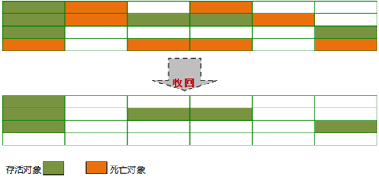

# Java虚拟机垃圾回收
### 一 、Java虚拟机垃圾回收基础

### 1、 什么是Java虚拟机垃圾回收

垃圾回收，或称垃圾收集（Garbage Collection，GC）是指自动管理回收不再被引用的内存数据。

在1960年诞生于MIT的Lisp语言首次使用了动态内存分配和垃圾收集技术，可以实现垃圾回收的一个基本要求是语言是类型安全的，现在使用的包括Java、Perl、ML等。

#### 1-1、为什么需要了解垃圾回收

目前内存的动态分配与内存回收技术已经相当成熟，但为什么还需要去了解内存分配与GC呢？  
1、当需要排查各种内存溢出、内存泄漏问题时；

2、当垃圾收集成为系统达到更高并发量的瓶颈时；

我们就需要对这些"自动化"技术实话必要的监控和调节；

#### 1-2、垃圾回收需要了解什么

**1、哪些内存需要回收？即如何判断对象已经死亡；**

**2、什么时候回收？即GC发生在什么时候？需要了解GC策略，与垃圾回收器实现有关；**

**3、如何回收？即需要了解垃圾回收算法，及算法的实现--垃圾回收器**  

### 2、判断对象可以回收

垃圾收集器对堆进行回收前，首先要确定堆中的对象哪些还"存活"，哪些已经"死去"；

下面先来了解两种判断对象不再被引用的算法，再来谈谈对象的引用，最后来看如何真正宣告一个对象死亡。

#### 2-1、引用计数算法（Recference Counting）

**1、算法基本思路**

给对象添加一个引用计数器，每当有一个地方引用它，计数器加1；

当引用失效，计数器值减1；

任何时刻计数器值为0，则认为对象是不再被使用的；

**2、优点**

实现简单，判定高效，可以很好解决大部分场景的问题，也有一些著名的应用案例；

**3、缺点**

（A）、很难解决对象之间相互循环引用的问题

``` bash
ReferenceCountingGC objA = new ReferenceCountingGC();
ReferenceCountingGC objB = new ReferenceCountingGC();
objA.instance = objB;
objB.instance = objA;
objA = null;
objB = null;
```

当两个对象不再被访问时，因为相互引用对方，导致引用计数不为0；

更复杂的循环数据结构，如图：


（B）、并且开销较大，频繁且大量的引用变化，带来大量的额外运算；

主流的JVM都没有选用引用计数算法来管理内存；

#### 2-2、可达性分析算法（Reachability Analysis）

也称为传递跟踪算法；

**主流的调用程序语言（Java、C#等）在主流的实现中，都是通过可达性分析来判定对象是否存活的。**

**1、算法基本思路**

通过一系列"GC Roots"对象作为起始点，开始向下搜索；

搜索所走过和路径称为引用链（Reference Chain）；

当一个对象到GC Roots没有任何引用链相连时（从GC Roots到这个对象不可达），则证明该对象是不可用的；


**2、GC Roots对象**

Java中，GC Roots对象包括：  
（1）虚拟机栈（栈帧中本地变量表）中引用的对象；

（2）方法区中类静态属性引用的对象；

（3）方法区中常量引用的对象；

（4）本地方法栈中JNI（Native方法）引用的对象；

主要在执行上下文中和全局性的引用；
**3、优点**

更加精确和严谨，可以分析出循环数据结构相互引用的情况；

**4、缺点**

实现比较复杂；

需要分析大量数据，消耗大量时间；

分析过程需要GC停顿（引用关系不能发生变化），即 **停顿所有Java执行线程** （称为 **"Stop The World"，是垃圾回收重点关注的问题** ）；

后面会针对HotSpot虚拟机实现的可达性分析算法进行介绍，看看是它**如何解决这些缺点的**。

#### 2-3、对象引用

java程序通过reference类型数据操作堆上的具体对象；

**1、JVM层面的引用**

reference类型是引用类型（Reference Types）的一种；

JVM规范规定reference类型来表示对某个对象的引用，可以想象成类似于一个指向对象的指针；
对象的操作、传递和检查都通过引用它的reference类型的数据进行操作；

**2、Java语言层面的引用**

**（i）、JDK1.2前的引用定义**  
如果reference类型的数据中存储的数值代表的是另外一块内存的起始地址，就称这块内存代表着一个引用；这种定义太过狭隘，无法描述更多信息；
**（ii）、JDK1.2后，对引用概念进行了扩充，将引用分为：**  
（1）强引用（Strong Reference）

程序代码普遍存在的，类似"Object obj=new Object()"；
只要强引用还存在，GC永远不会回收被引用的对象；  
（2）软引用（Soft Reference）

用来描述还有用但并非必需的对象；

直到内存空间不够时（抛出OutOfMemoryError之前），才会被垃圾回收；最常用于实现对内存敏感的缓存；SoftReference类实现；  
（3）弱引用（Weak Reference）

用来描述非必需对象；只能生存到下一次垃圾回收之前，无论内存是否足够；WeakReference类实现；  
（4）虚引用（Phantom Reference）

也称为幽灵引用或幻影引用；完全不会对其生存时间构成影响；唯一目的就是能在这个对象被回收时收到一个系统通知；PhantomRenference类实现；

#### 2-4、判断对象生存还是死亡

要真正宣告一个对象死亡，至少要经历两次标记过程。

**1、第一次标记**

在可达性分析后发现到GC Roots没有任何引用链相连时，被第一次标记；

并且进行一次筛选：此对象是否必要执行finalize()方法；  
**（A）没有必要执行**

没有必要执行的情况：  
(1) 对象没有覆盖finalize()方法；

(2) finalize()方法已经被JVM调用过；

这两种情况就**可以认为对象已死**，可以回收；

**(B)****有必要执行**

对有必要执行finalize()方法的对象，被放入F-Queue队列中；

稍后在JVM自动建立、低优先级的Finalizer线程（可能多个线程）中触发这个方法；
**2、第二次标记**

GC将对F-Queue队列中的对象进行第二次小规模标记；

finalize()方法是对象逃脱死亡的最后一次机会：

（A）、如果对象在其finalize()方法中重新与引用链上任何一个对象建立关联，第二次标记时会将其移出"即将回收"的集合；

（B）、如果对象没有，也可以认为对象已死，可以回收了；

一个对象的finalize()方法只会被系统自动调用一次，经过finalize()方法逃脱死亡的对象，第二次不会再调用；

#### 2-5、finalize()方法

上面已经说到finalize()方法与垃圾回收第二次标记相关，下面了解下 **在Java语言层面有哪些需要注意的** 。

finalize()是Object类的一个方法，是Java刚诞生时为了使C/C++程序员容易接受它所做出的一个妥协，但不要当作类似C/C++的析构函数；
因为它执行的时间不确定，甚至是否被执行也不确定（Java程序的不正常退出），而且运行代价高昂，无法保证各个对象的调用顺序（甚至有不同线程中调用）；

如果需要"释放资源"，可以定义显式的终止方法，并在"try-catch-finally"的finally{}块中保证及时调用，如File相关类的close()方法；

此外，finalize()方法主要有两种用途：  
**1、充当"安全网"**

当显式的终止方法没有调用时，在finalize()方法中发现后发出警告；

但要考虑是否值得付出这样的代价；如FileInputStream、FileOutputStream、Timer和Connection类中都有这种应用;

2、**与对象的本地对等体有关**

本地对等体：普通对象调用本地方法（JNI）委托的本地对象；本地对等体不会被GC回收；

如果本地对等体不拥有关键资源，finalize()方法里可以回收它（如C/C++中malloc()，需要调用free()）；

如果有关键资源，必须显式的终止方法；
**一般情况下，应尽量避免使用它，甚至可以忘掉它。**

### 3、HotSpot虚拟机中对象可达性分析的实现

前面对可达性分析算法进行介绍，并看到了它在判断对象存活与死亡的作用，下面看看是HotSpot虚拟机是如何实现可达性分析算法，**如何解决相关缺点的。**

#### 3-1、可达性分析的问题

**1、消耗大量时间**
从前面可达性分析知道，GC Roots主要在全局性的引用（常量或静态属性）和执行上下文中（栈帧中的本地变量表）；

要在这些大量的数据中，逐个检查引用，会消耗很多时间；

**2、GC停顿**

可达性分析期间需要保证整个执行系统的一致性，对象的引用关系不能发生变化；

**导致GC进行时必须停顿所有Java执行线程** （称为 **"Stop The World"** ）；

（几乎不会发生停顿的CMS收集器中，枚举根节点时也是必须要停顿的）

**Stop The World：**  
是JVM在后台自动发起和自动完成的；在用户不可见的情况下，把用户正常的工作线程全部停掉；

#### 3-2、枚举根节点

枚举根节点也就是查找GC Roots；

目前主流JVM都是准确式GC，可以直接得知哪些地方存放着对象引用，所以执行系统停顿下来后，并不需要全部、逐个检查完全局性的和执行上下文中的引用位置；

在HotSpot中，是使用一组称为OopMap的数据结构来达到这个目的的；  
在类加载时，计算对象内什么偏移量上是什么类型的数据；

在JIT编译时，也会记录栈和寄存器中的哪些位置是引用；

这样GC扫描时就可以直接得知这些信息；

#### 3-3、安全点

**1、安全点是什么，为什么需要安全点**

HotSpot在OopMap的帮助下可以快速且准确的完成GC Roots枚举，但是这有一个问题：  
运行中，非常多的指令都会导致引用关系变化；如果为这些指令都生成对应的OopMap，需要的空间成本太高；
问题解决：  
**只在特定的位置记录OopMap引用关系** ，这些位置称为**安全点（Safepoint）** ；

即程序执行时并非所有地方都能停顿下来开始GC；
**2、安全点的选定**

不能太少，否则GC等待时间太长；也不能太多，否则GC过于频繁，增大运行时负荷；

所以，基本上是以程序"是否具有让程序长时间执行的特征"为标准选定；

"长时间执行"最明显的特征就是指令序列复用，如：方法调用、循环跳转、循环的末尾、异常跳转等；

只有具有这些功能的指令才会产生Safepoint；
**3、如何在安全点上停顿**

对于Safepoint，如何在GC发生时让所有线程（不包括JNI线程）运行到其所在最近的Safepoint上再停顿下来？

主要有两种方案可选：  
**（A）抢先式中断（Preemptive Suspension）**

不需要线程主动配合，实现如下：

（1）在GC发生时，首先中断所有线程；
（2）如果发现不在Safepoint上的线程，就恢复让其运行到Safepoint上；  
**现在几乎没有JVM实现采用这种方式；**

**（B）主动式中断（Voluntary Suspension）**

（1）在GC发生时，不直接操作线程中断，而是仅简单设置一个标志；

（2）让各线程执行时主动去轮询这个标志，发现中断标志为真时就自己中断挂起；

而轮询标志的地方和Safepoint是重合的；

在JIT执行方式下：test指令是HotSpot生成的轮询指令；一条test汇编指令便完成Safepoint轮询和触发线程中断；

#### 3-4、安全区域

**1、为什么需要安全区域**

对于上面的Safepoint还有一个问题：

> 程序不执行时没有CPU时间（Sleep或Blocked状态），无法运行到Safepoint上再中断挂起；
这就需要安全区域来解决；

**2、什么是安全区域（Safe Region）**

指一段代码片段中，引用关系不会发生变化；

在这个区域中的任意地方开始GC都是安全的；

**3、如何用安全区域解决问题**

安全区域解决问题的思路：  
（1）线程执行进入Safe Region，首先标识自己已经进入Safe Region；

（2）线程被唤醒离开Safe Region时，其需要检查系统是否已经完成根节点枚举（或整个GC）；
如果已经完成，就继续执行；否则必须等待，直到收到可以安全离开Safe Region的信号通知，这样就不会影响标记结果；  
虽然HotSpot虚拟机中采用了这些方法来解决对象可达性分析的问题，但只是大大减少了这些问题影响，**并不能完全解决，如GC停顿"Stop The World"是垃圾回收重点关注的问题，后面介绍垃圾回收器时应注意：低GC停顿是其一个关注。**

### 二、 回收算法

下面先来了解Java虚拟机垃圾回收的几种常见算法：标记-清除算法、复制算法、标记-整理算法、分代收集算法、火车算法，介绍它们的算法思路，有什么优点和缺点，以及主要应用场景。

### 1、标记-清除算法

标记-清除（Mark-Sweep）算法是一种基础的收集算法。

**1、算法思路**

"标记-清除"算法，分为两个阶段：  
**（A）标记**

**首先标记出所有需要回收的对象；标记过程如下**
**（1）第一次标记**  
在可达性分析后发现对象到GC Roots没有任何引用链相连时，被第一次标记；

并且进行一次筛选：此对象是否必要执行finalize()方法；

对有必要执行finalize()方法的对象，被放入F-Queue队列中；

（2）**第二次标记**

GC将对F-Queue队列中的对象进行第二次小规模标记；

在其finalize()方法中重新与引用链上任何一个对象建立关联，第二次标记时会将其移出"即将回收"的集合；

**对第一次被标记，且第二次还被标记（如果需要，但没有移出"即将回收"的集合），就可以认为对象已死，可以进行回收**。

（B）**清除**

两次标记后，还在"即将回收"集合的对象将被统一回收；

**执行过程如下图：**



**2、优点**

基于最基础的可达性分析算法，它是最基础的收集算法；

而后续的收集算法都是基于这种思路并对其不足进行改进得到的；

**3、缺点**

主要有两个缺点：  
（A）效率问题

标记和清除两个过程的效率都不高；  
（B）空间问题

标记清除后会产生大量不连续的内存碎片；这会导致分配大内存对象时，无法找到足够的连续内存；从而需要提前触发另一次垃圾收集动作；
**4、应用场景**

**针对老年代的CMS收集器；**

### 2、复制算法算法

"复制"（Copying）收集算法，为了解决标记-清除算法的效率问题；

**1、算法思路**

（A）把内存划分为大小相等的两块，每次只使用其中一块；

（B）当一块内存用完了，就将还存活的对象复制到另一块上（而后使用这一块）；

（C）再把已使用过的那块内存空间一次清理掉，而后重复步骤2；

**执行过程如下图：**


**2、优点**

这使得每次都是只对整个半区进行内存回收；

内存分配时也不用考虑内存碎片等问题（可使用"指针碰撞"的方式分配内存）；

实现简单，运行高效；

**3、缺点**

**（A）**空间浪费

可用内存缩减为原来的一半，太过浪费（解决：可以改良，不按1:1比例划分）；  
（B）效率随对象存活率升高而变低

当对象存活率较高时，需要进行较多复制操作，效率将会变低（解决：后面的标记-整理算法）；
**4、应用场景**

现在商业JVM都采用这种算法（通过改良缺点1）来回收新生代；

**如Serial收集器、ParNew收集器、Parallel Scavenge收集器、、G1（从局部看）；**

**5、HotSpot虚拟机的改良算法**  
**（A）弱代理论**

分代垃圾收集基于弱代理论（weak generational hypothesis），具体描述如下：

（1）大多数分配了内存的对象并不会存活太长时间，在处于年轻代时就会死掉；

（2）很少有对象会从老年代变成年轻代；

其中IBM研究表明：新生代中98%的对象都是"朝生夕死"；

所以并不需要按1:1比例来划分内存（解决了缺点1）；

**（B）HotSpot虚拟机新生代内存布局及算法**
（1）将新生代内存分为一块较大的Eden空间和两块较小的Survivor空间；

（2）每次使用Eden和其中一块Survivor；

（3）当回收时，将Eden和使用中的Survivor中还存活的对象一次性复制到另外一块Survivor；

（4）而后清理掉Eden和使用过的Survivor空间；

（5）后面就使用Eden和复制到的那一块Survivor空间，重复步骤3；

默认Eden：Survivor=8:1，即每次可以使用90%的空间，只有一块Survivor的空间被浪费；
**（C）分配担保**

如果另一块Survivor空间没有足够空间存放上一次新生代收集下来的存活对象时，这些对象将直接通过分配担保机制（Handle Promotion）进入老年代；

分配担保在以后讲解垃圾收集器执行规则时再详解；

### 3、标记-整理算法

"标记-整理"（Mark-Compact）算法是根据老年代的特点提出的。

**1 算法思路**  
（1）标记

标记过程与"标记-清除"算法一样；

（2）整理

但后续不是直接对可回收对象进行清理，而是让所有存活的对象都向一端移动；

然后直接清理掉端边界以外的内存；

**执行过程如下图：**


**2 优点**

**（A）不会像复制算法，效率随对象存活率升高而变低**  
老年代特点：

对象存活率高，没有额外的空间可以分配担保；

所以老年代一般不能直接选用复制算法算法；  
而选用标记-整理算法；

（B）**不会像标记-清除算法，产生内存碎片**

因为清除前，进行了整理，存活对象都集中到空间一侧；
**3 缺点**

主要是效率问题：除像标记-清除算法的标记过程外，还多了需要整理的过程，效率更低；

**4 应用场景**

很多垃圾收集器采用这种算法来回收老年代；

**如Serial Old收集器、G1（从整体看）；**

### 4、分代收集算法

"分代收集"（Generational Collection）算法结合不同的收集算法处理不同区域。

**1、算法思路**

基于前面说的弱代理论，其实并没有什么新的思想；

只是根据对象存活周期的不同将内存划分为几块；

这样就可以根据各个年代的特点采用最适当的收集算法；

一般把Java堆分为新生代和老年代；  
**（A）新生代**

每次垃圾收集都有大批对象死去，只有少量存活；所以可采用复制算法；

（B）**老年代**

对象存活率高，没有额外的空间可以分配担保；使用"标记-清理"或"标记-整理"算法；

结合上面对新生代的内存划分介绍和上篇文章对Java堆的介绍，可以得出HotSpot虚拟机一般的年代内存划分，如下图：


**2、优点**  
可以根据各个年代的特点采用最适当的收集算法；
**3、缺点**  
仍然不能控制每次垃圾收集的时间；
**4、应用场景**

目前几乎所有商业虚拟机的垃圾收集器都采用分代收集算法；

如HotSpot虚拟机中全部垃圾收集器：Serial、ParNew、Parallel Scavenge、Serial Old、Parallel Old、CMS、G1（也保留）；

### 5、火车算法

火车算法也称列车算法，是一种更彻底的分区域处理收集算法，是对分代收集算法的一个有力补充。

**1、算法思路**

在火车算法中，内存被分为块，多个块组成一个集合。为了形象化，一节车厢代表一个块，一列火车代表一个集合，如下图；

火车与车箱都按创建顺序标号，每个车厢大小相等，但每个火车包含的车厢数不一定相等；

每节车箱有一个被记忆集合，而每辆火车的记忆集合是它所有车厢记忆集合的总和；

记忆集合由指向车箱中对象的引用组成，这些引用来自同一辆火车中序号较高的车箱中的对象，以及序号较高中的对象；

垃圾收集以车厢为单位，整体算法流程如下：  
（1）选择标号最小的火车；

（2）如果火车的记忆集合是空的, 释放整列火车并终止, 否则进行第三步操作；

（3）选择火车中标号最小的车厢；

（4）对于车厢记忆集合的每个元素：

如果它是一个被根引用引用的对象, 那么, 将拷贝到一列新的火车中去；

如果是一个被其它火车的对象指向的对象, 那么, 将它拷贝到这个指向它的火车中去.；

假设有一些对象已经被保留下来了, 那么通过这些对象可以触及到的对象将会被拷贝到同一列火车中去；

如果一个对象被来自多个火车的对象引用, 那么它可以被拷贝到任意一个火车去；

这个步骤中, 有必要对受影响的引用集合进行相应地更新；

（5）、释放车厢并且终止；

收集过程会删除一些空车箱和空车，当需要的时候也会创建一些车箱和火车。

**执行过程如下图：**


**2、优点**

可以在成熟对象空间提供限定时间的渐近收集；

而不需要每次都进行一个大区域的垃圾回收过程；

**即可以控制垃圾回收的时间，在指定时间内进行一些小区域的回收；**

**3、缺点**

实现较为复杂，如采用类似的算法的G1收集器在JDK7才实现；

一些场景下可能性价比不高；

**4、应用场景**

JDK7后HotSpot虚拟机 **G1收集器** 采用 **类似的算法** ，能建立可预测的停顿时间模型；  

### 三、垃圾收集器

垃圾收集器是垃圾回收算法（标记-清除算法、复制算法、标记-整理算法、火车算法）的具体实现，不同商家、不同版本的JVM所提供的垃圾收集器可能会有很在差别，下面主要介绍HotSpot虚拟机中的垃圾收集器。

### 1、垃圾收集器概述

#### 1-1、垃圾收集器组合

JDK7/8后，HotSpot虚拟机所有收集器及组合（连线），如下图：


**新生代收集器** ：Serial、ParNew、Parallel Scavenge；

**老年代收集器** ：Serial Old、Parallel Old、CMS；

**整堆收集器** ：G1；

### 2、Serial收集器

Serial（串行）垃圾收集器是最基本、发展历史最悠久的收集器；

JDK1.3.1前是HotSpot新生代收集的唯一选择；

**1、特点**

针对新生代；

采用复制算法；

单线程收集；

进行垃圾收集时，必须暂停所有工作线程，直到完成；

即会"Stop The World"；

**Serial/Serial Old组合收集器运行示意图如下：**


### 3、ParNew收集器

ParNew垃圾收集器是 **Serial收集器的多线程版本** 。

**1、特点**

除了多线程外，其余的行为、特点和Serial收集器一样；

如Serial收集器可用控制参数、收集算法、Stop The World、内存分配规则、回收策略等；

两个收集器共用了不少代码；

**ParNew/Serial Old组合收集器运行示意图如下：**


### 4、Parallel Scavenge收集器

Parallel Scavenge垃圾收集器因为与吞吐量关系密切，也称为 **吞吐量收集器（Throughput Collector）** 。

**1、特点**  
（A）有一些特点与**ParNew收集器相似**

新生代收集器；

采用复制算法；

多线程收集；

（B）**主要特点是：它的关注点与其他收集器不同**

CMS等收集器的关注点是尽可能地缩短垃圾收集时用户线程的停顿时间；

而Parallel Scavenge收集器的目标则是**达一个可控制的吞吐量（Throughput）**；

**关于吞吐量与收集器关注点说明详见本节后面；**

**上面介绍的都是新生代收集器，接下来开始介绍老年代收集器；**

### 5、Serial Old收集器

> Serial Old是**Serial收集器的老年代版本**；
>
> **1、特点**
>
> 针对老年代；
>
> 采用"标记-整理"算法（还有压缩，Mark-Sweep-Compact）；
>
> 单线程收集；
>
> Serial/Serial Old收集器运行示意图如下：


### 6、Parallel Old收集器

Parallel Old垃圾收集器是Parallel Scavenge收集器的老年代版本；

JDK1.6中才开始提供；

**1、特点**

针对老年代；

采用"标记-整理"算法；

多线程收集；

**Parallel Scavenge/Parallel Old收集器运行示意图如下：**


### 7、CMS收集器

并发标记清理（Concurrent Mark Sweep，CMS）收集器也称为并发低停顿收集器（Concurrent Low Pause Collector）或低延迟（low-latency）垃圾收集器；

在前面ParNew收集器曾简单介绍过其特点；

**1、特点**

针对老年代；

基于"标记-清除"算法(不进行压缩操作，产生内存碎片)；

以获取最短回收停顿时间为目标；

并发收集、低停顿；

需要更多的内存（看后面的缺点）；

是HotSpot在JDK1.5推出的第一款真正意义上的并发（Concurrent）收集器；

第一次实现了让垃圾收集线程与用户线程（基本上）同时工作；

整个过程中耗时最长的并发标记和并发清除都可以与用户线程一起工作；

所以总体上说，CMS收集器的内存回收过程与用户线程一起并发执行；

**CMS收集器运行示意图如下：**


**CMS收集器3个明显的缺点**

**（A）对CPU资源非常敏感**

**（B）无法处理浮动垃圾,可能出现"Concurrent Mode Failure"失败**

**（C）产生大量内存碎片**

### 8、G1收集器

G1（ **Garbage-First** ）是 **JDK7-u4** 才推出商用的收集器；

**1、特点**

**（A）并行与并发**
能充分利用多CPU、多核环境下的硬件优势；

可以并行来缩短"Stop The World"停顿时间；

也可以并发让垃圾收集与用户程序同时进行；

**（B）分代收集，收集范围包括新生代和老年代** 能独立管理整个GC堆（新生代和老年代），而不需要与其他收集器搭配；

能够采用不同方式处理不同时期的对象；

虽然保留分代概念，但Java堆的内存布局有很大差别；

将整个堆划分为多个大小相等的独立区域（Region）；

新生代和老年代不再是物理隔离，它们都是一部分Region（不需要连续）的集合；  
**（C）结合多种垃圾收集算法，空间整合，不产生碎片**

从整体看，是基于标记-整理算法；

从局部（两个Region间）看，是基于复制算法；

这是一种类似火车算法的实现；都不会产生内存碎片，有利于长时间运行；

（D）**可预测的停顿：低停顿的同时实现高吞吐量**

G1除了追求低停顿处，还能建立可预测的停顿时间模型；

可以明确指定M毫秒时间片内，垃圾收集消耗的时间不超过N毫秒；

**G1收集器运作过程**

不计算维护Remembered Set的操作，可以分为4个步骤（与CMS较为相似）。

（A）**初始标记（Initial Marking）**

仅标记一下GC Roots能直接关联到的对象；

且修改TAMS（Next Top at Mark Start）,让下一阶段并发运行时，用户程序能在正确可用的Region中创建新对象；需要"Stop The World"，但速度很快；

（B）**并发标记（Concurrent Marking）**

进行GC Roots Tracing的过程；刚才产生的集合中标记出存活对象；耗时较长，但应用程序也在运行；并不能保证可以标记出所有的存活对象；

（C）**最终标记（Final Marking）**

为了修正并发标记期间因用户程序继续运作而导致标记变动的那一部分对象的标记记录；

上一阶段对象的变化记录在线程的Remembered Set Log；

这里把Remembered Set Log合并到Remembered Set中；

需要"Stop The World"，且停顿时间比初始标记稍长，但远比并发标记短；

采用多线程并行执行来提升效率；

（D）**筛选回收（Live Data Counting and Evacuation）**

首先排序各个Region的回收价值和成本；

然后根据用户期望的GC停顿时间来制定回收计划；

最后按计划回收一些价值高的Region中垃圾对象；

回收时采用"复制"算法，从一个或多个Region复制存活对象到堆上的另一个空的Region，并且在此过程中压缩和释放内存；

可以并发进行，降低停顿时间，并增加吞吐量；

### 四、内存分配与回收策略 方法区垃圾回收 以及 JVM垃圾回收的调优方法

#### 1、内存分配

在堆上分配（JIT编译优化后可能在栈上分配），主要在新生代的Eden区中分配；

如果启用了本地线程分配缓冲，将线程优先在TLAB上分配；

少数情况下，可能直接分配在老年代中。

分配的细节取决于当前使用哪种垃圾收集器组合，以及JVM中内存相关参数设置。

接下来将会讲解几条最普遍的内存分配规则。

#### 1-1、对象优先在Eden分配

默认Eden：Survivor=8:1，即每次可以使用90%的空间，只有一块Survivor的空间被浪费；

大多数情况下，对象在新生代Eden区中分配；

当Eden区没有足够空间进行分配时，JVM将发起一次Minor GC（新生代GC）；

Minor GC时，如果发现存活的对象无法全部放入Survivor空间，只好通过分配担保机制提前转移到老年代。

#### 1-2、大对象直接进入老年代

大对象指需要大量连续内存空间的Java对象，如，很长的字符串、数组；

经常出现大对象容易导致内存还有不少空间就提前触发GC,以获取足够的连续空间来存放它们，所以应该尽量避免使用创建大对象；

#### 1-3、长期存活的对象将进入老年代

JVM给每个对象定义一个对象年龄计数器，其计算流程如下：

在Eden中分配的对象，经Minor GC后还存活，就复制移动到Survivor区，年龄为1；

而后每经一次Minor GC后还存活，在Survivor区复制移动一次，年龄就增加1岁；

如果年龄达到一定程度，就晋升到老年代中；

#### 1-4、动态对象年龄判定

**如果在Survivor空间中相同年龄的所有对象大小总和大于Survivor空间的一半，大于或等于该年龄的对象就可以直接进入老年代**

#### 1-5、空间分配担保

### 2、回收方法区

#### 2-1、方法区（永久代）的主要回收对象

**1、废弃常量**

与回收Java堆中对象非常类似；

**2、无用的类**

同时满足下面3个条件才能算"无用的类"：  
（1）该类所有实例都已经被回收（即Java椎中不存在该类的任何实例）；

（2）加载该类的ClassLoader已经被回收，也即通过引导程序加载器加载的类不能被回收；

（3）该类对应的java.lang.Class对象没有在任何地方被引用，无法在任何地方通过反射访问该类的方法；

#### 2-2、需要注意方法区回收的应用

在 **大量使用反射、动态代理、经常动态生成大量类的应用** ，要注意类的回收；

如运行时动态生成类的应用：  
1、CGLib在Spring、Hibernate等框架中对类进行增强时会使用；

2、VM的动态语言也会动态创建类来实现语言的动态性；

3、另外，JSP（第一次使用编译为Java类）、基于OSGi频繁自定义ClassLoader的应用（同一个类文件，不同加载器加载视为不同类）等；

#### 2-3、HotSpot虚拟机的相关调整

**1、在JDK7中**

使用永久代（Permanent Generation）实现方法区，这样就可以不用专门实现方法区的内存管理，但这容易引起内存溢出问题；

有规划放弃永久代而改用Native Memory来实现方法区；

不再在Java堆的永久代中生成中分配字符串常量池，而是在Java堆其他的主要部分（年轻代和老年代）中分配；

**2、在JDK8中**

永久代已被删除，类元数据（Class Metadata）存储空间在本地内存中分配，并用显式管理元数据的空间：  
从OS请求空间，然后分成块；

类加载器从它的块中分配元数据的空间（一个块被绑定到一个特定的类加载器）；

当为类加载器卸载类时，它的块被回收再使用或返回到操作系统；

元数据使用由mmap分配的空间，而不是由malloc分配的空间；
**3、相关参数**

"-XX：MaxMetaspaceSize" （JDK8）：指定类元数据区的最大内存大小；

"-XX：MetaspaceSize" （JDK8）：指定类元数据区的内存阈值--超过将触发垃圾回收；

**"-Xnolassgc"** ：控制是否对类进行回收；

"-verbose:class"、"-XX:TraceClassLoading"、"-XX:TraceClassUnloading"：查看类加载和卸载信息；

### 3、JVM垃圾回收的调优方法

内存回收与垃圾收集器是影响系统性能、并发能力的主要因素之一，一般都需要进行一些手动的测试、调整优化；

下面介绍的是一些思路，并非是具体的参数设置。

#### 3-1、明确期望的目标（关注点）

首先应该明确我们的应用程序调整垃圾回收期望的目标（关注点）是什么？

在前文曾介绍过通常有这些关注点：  
**（1）停顿时间**

GC停顿时间越短就适合需要与用户交互的程序，良好的响应速度能提升用户体验；

与用户交互较多的场景，以给用户带来较好的体验；

如常见WEB、B/S系统的服务器上的应用；

（2）**吞吐量**

吞吐量=运行用户代码时间/（运行用户代码时间+垃圾收集时间）；

高吞吐量可以高效率地利用CPU时间，尽快完成运算的任务，主要适合在后台计算而不需要太多交互的任务；

应用程序运行在具有多个CPU上，对暂停时间没有特别高的要求；

程序主要在后台进行计算，而不需要与用户进行太多交互；

例如，那些执行批量处理、订单处理、工资支付、科学计算的应用程序；

（3）**覆盖区（Footprint）**

在达到前面两个目标的情况下，尽量减少堆的内存空间，以获得更好的空间局部性；

可以减少到不满足前两个目标为止，然后再解决未满足的目标；

如果是动态收缩的堆设置，堆的大小将随着垃圾收集器试图满足竞争目标而振荡；

**总结就是：低停顿、高吞吐量、少用内存资源；**

一般这些目标都相互影响的，增大堆内存获得高吞吐量但会增长停顿时间，反之亦然，有时需折中处理。

#### 3-2、JVM自适应调整（Ergonomics）

JVM有自适应选择、调整相关设置的功能；  
一般都会先根据平台性能来选择好垃圾收集器，以及设置好其参数；

在运行中，一些收集器还会收集监控信息来自动地、动态的调整垃圾回收策略；
所以当我们不知道何如选择收集器和调整时，应该首先让JVM自适应调整；

然后通过输出GC日志进行分析，看能不能满足明确期望的目标（第一步）；

如果不能满足，或者通过打印设置的参数信息，发现可以有更好的调优时，可以进行手动指定参数进行设置，并测试；

#### 3-3、实践调优：选择垃圾收集器，并进行相关设置

需要明确一个观点：  
没有最好的收集器，更没有万能的收集；

选择的只能是对具体应用最适合的收集器；

我们知道HotSpot有这些组合可以搭配使用：

Serial/Serial Old、Serial/CMS、ParNew/Serial Old、ParNew/CMS、Parallel Scavenge/Serial Old、Parallel Scavenge/Parallel Old、G1；
到实践调优阶段，那必须要了解每个具体收集器的行为特点、优势和劣势、调节参数等（请参考前面的文章内容）；

然后根据明确期望的目标，选择具体应用最适合的收集器；

当选择使用某种并行垃圾收集器时，应该指定期望的具体目标而不是指定堆的大小；  
让垃圾收集器自动地、动态的调整堆的大小来满足期望的行为；

即堆的大小将随着垃圾收集器试图满足竞争目标而振荡；
当然有时发现问题，堆的大小、划分也是需要进行一些调整的，一般规则：  
除非应用程序无法接受长时间的暂停，否则可以将堆调的尽可能大一些；

除非发现问题的原因在于老年代的垃圾收集或应用程序暂停次数过多，否则你应该将堆的较大部分分给年轻代；

等等...

例如，使用Parallel Scavenge/Parallel Old组合，这是一种值得推荐的方式：

1、只需设置好内存数据大小（如"-Xmx"设置最大堆）；  
2、然后使用"-XX:MaxGCPauseMillis"或"-XX:GCTimeRatio"给JVM设置一个优化目标；

3、那些具体细节参数的调节就由JVM自适应完成；

设置调整后，应该通过在产生环境下进行不断测试，来分析是否达到我们的目标；

引用：

1、[blog.csdn.net/tjiyu/artic...](https://blog.csdn.net/tjiyu/article/details/53982412)

2、[blog.csdn.net/tjiyu/artic...](https://blog.csdn.net/tjiyu/article/details/53983064)

3、[blog.csdn.net/tjiyu/artic...](https://blog.csdn.net/tjiyu/article/details/53983650)

4、[blog.csdn.net/tjiyu/artic...](https://blog.csdn.net/tjiyu/article/details/54588494)

## 声明

原文地址: [Java虚拟机垃圾回收](https://juejin.im/post/5aed3f2bf265da0b886d4d31)